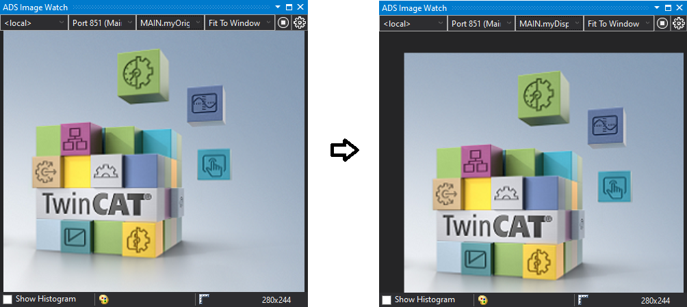

# Code Snippet - F_VN_ApplyTranslationToAffineTransformation
What is a code snippet? These are mini blocks of code which help me to remember and reuse parts of Infosys.  
These are not "Wow" level examples.  They are just ultra simple, copy paste code.  But as always, I like to share.

## Disclaimer
This is a personal guide not a peer reviewed journal or a sponsored publication. We make
no representations as to accuracy, completeness, correctness, suitability, or validity of any
information and will not be liable for any errors, omissions, or delays in this information or any
losses injuries, or damages arising from its display or use. All information is provided on an as
is basis. It is the reader’s responsibility to verify their own facts.

The views and opinions expressed in this guide are those of the authors and do not
necessarily reflect the official policy or position of any other agency, organization, employer or
company. Assumptions made in the analysis are not reflective of the position of any entity
other than the author(s) and, since we are critically thinking human beings, these views are
always subject to change, revision, and rethinking at any time. Please do not hold us to them
in perpetuity.

## Overview 
This is a code snippet example of F_VN_ApplyTranslationToAffineTransformation.

## Screenshot


## Code Snippets

```
PROGRAM MAIN
VAR
	readImage: FB_VN_ReadImage;
	myImage : ITcVnImage;
	myTranslatedImage : ITcVnImage;
	transformationMatrix : TcVnMatrix2x3_LREAL;
	myOriginalImage   : ITcVnDisplayableImage;
	myDisplayableImage   : ITcVnDisplayableImage;
	hr : HRESULT;	
END_VAR
```
```
readImage(
    sFilePath   :=  'C:\temp\image.png', 
    ipDestImage :=  myImage,
    bRead       :=  TRUE,
    nTimeout    :=  T#500MS
);

IF readImage.bBusy OR readImage.bError OR myImage = 0 THEN
    RETURN;
END_IF

hr := F_VN_GenerateAffineTransformationUnitMatrix2D(transformationMatrix, hr);
hr := F_VN_ApplyTranslationToAffineTransformation(transformationMatrix, 20.0,20.0,hr);
hr := F_VN_WarpAffine(myImage,myTranslatedImage,transformationMatrix,hr);

hr := F_VN_TransformIntoDisplayableImage(myImage, myOriginalImage, S_OK);
hr := F_VN_TransformIntoDisplayableImage(myTranslatedImage, myDisplayableImage, S_OK);
```

## Versions
* TcXaeShell 3.1.4024.22
* TwinCAT Vision 4.0.2.13

## Need more help?
Please visit http://beckhoff.com/ for further guides
